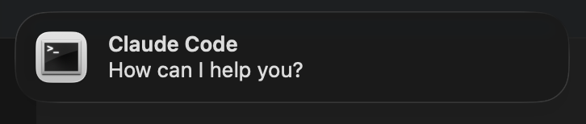
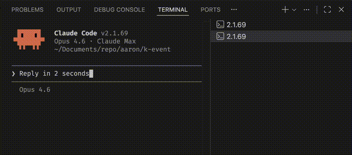
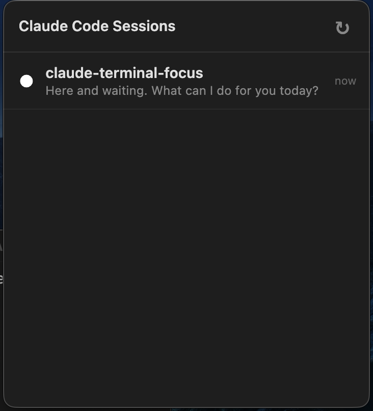

# Claude Terminal Focus

> Native macOS notifications for [Claude Code](https://claude.ai/code) — click to jump to the right VSCode terminal tab.






## The problem

You kick off a task in Claude Code and switch to something else. Minutes later, Claude is done — or stuck waiting for permission — but you have no idea. You keep checking back manually.

## The solution

This tool sends a macOS notification when Claude Code needs you. Click the notification to jump straight to the right terminal tab.

**Works with multiple sessions** — if you have 3 Claude Code terminals open, it knows which one to focus.

## Features

- **Finish notification** — shows a summary of Claude's last response
- **Permission notification** — shows what Claude is waiting for
- **▸ thinking marker** — terminal tab shows `▸` while Claude is processing
- **● done marker** — switches to `●` when Claude finishes, auto-cleared when you switch to it
- **Smart skip** — no notification if you're already looking at that terminal
- **Precise matching** — uses shell PID to distinguish multiple sessions
- **Menubar app** — global overview of all Claude Code sessions across all VSCode windows; click to focus, swipe to dismiss

## Install

```bash
brew install jq terminal-notifier
git clone https://github.com/aaronhg/claude-terminal-focus.git
cd claude-terminal-focus
./install.sh
```

Then reload VSCode: `Cmd+Shift+P` → `Reload Window`.

## Uninstall

```bash
./uninstall.sh
```

## How it works

```
You submit a prompt
  → tab name becomes "▸ 2.1.69" (thinking)

Claude Code stops
  → tab name becomes "● 2.1.69" (done)
  → macOS notification with response summary
  → click notification → focus the correct terminal
  → or switch to it manually → marker clears
```

The hook script discovers the terminal's shell PID by walking up the process tree (`hook → claude → shell`). The VSCode extension matches this against `terminal.processId` to find the right tab.

### Menubar app



The menubar app shows all active Claude Code sessions in a dropdown list, across all VSCode windows.

- **Click** an item → focuses the correct VSCode window and terminal tab
- **Swipe left** (trackpad two-finger) → dismisses the item
- **Badge count** on the tray icon shows how many sessions need attention
- **Auto-starts on login** via macOS LaunchAgent

```bash
./start.sh   # Restart (e.g. after code changes)
./stop.sh    # Stop
```

## What gets installed

| Component | Location |
|-----------|----------|
| Hook scripts | `~/.claude/hooks/notify-thinking.sh`, `notify-stop.sh`, `notify-attention.sh`, `_upsert-state.sh` |
| VSCode extension | `~/.vscode/extensions/claude-terminal-focus` (symlink) |
| Menubar app | `menubar-app/` (Electron + menubar) |
| Hook config | Merged into `~/.claude/settings.json` |
| LaunchAgent | `~/Library/LaunchAgents/com.aaron.claude-menubar.plist` |
| Shared state | `~/.claude/hooks/.focus-state.json` (all sessions) |

The install script merges hook config into your existing settings without overwriting anything else. If you already have `Stop` or `Notification` hooks, it will ask before overwriting.

## Requirements

- macOS
- VSCode
- [Claude Code](https://claude.ai/code)

## Contributing

Issues and PRs welcome. See [DEVELOPMENT.md](./DEVELOPMENT.md) for the design decisions and iteration history behind this tool.

## License

MIT
